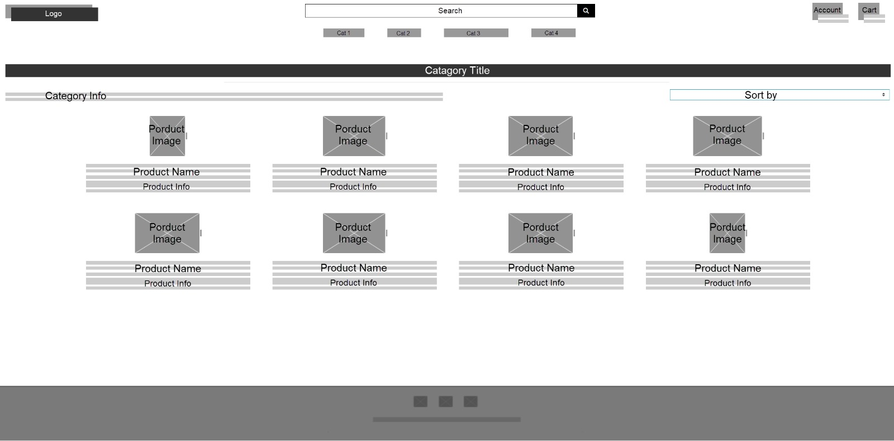
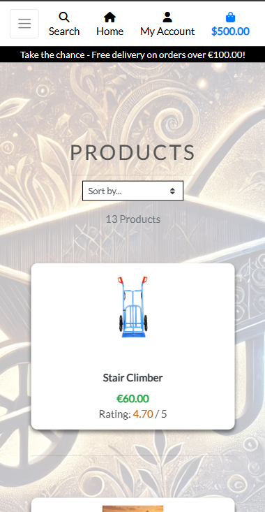
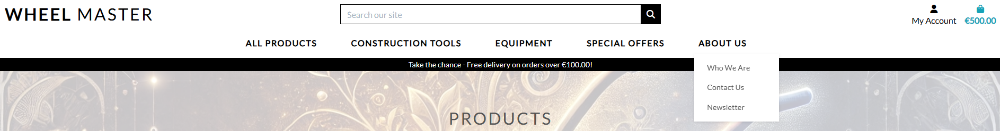

# Wheelmaster - E-commerce Site

Welcome to Wheelmaster, a fully responsive e-commerce website created for Portfolio Project 5 as part of the Code Institute Full-Stack Developer course.

Visit the live site here: [Wheelmaster](https://wheelmaster-fd0d6b0f7d27.herokuapp.com/)

[Github Repository](https://github.com/mufasa1611/Wheelmaster_p5)

## Table of Contents

1. [Project Goals](#project-goals)  
2. [Agile](#agile)  
3. [User Experience (UX)](#user-experience-ux)  
    - [Target Audience](#target-audience)  
    - [Site Goals](#site-goals)  
4. [Design](#design)  
    - [Database Model](#database-model)  
    - [Wireframes](#wireframes)  
    - [Color Scheme](#color-scheme)  
    - [Typography](#typography)  
    - [Images](#images)  
    - [Responsiveness](#responsiveness)  
5. [SEO & Marketing Research](#seo--marketing-research)  
6. [Features](#features)  
    - [Design Features](#design-features)  
    - [Website Pages for Users](#website-pages-for-users)  
    - [Additional Pages for Admins (Superusers)](#additional-pages-for-admins-superusers)  
7. [Technologies](#technologies)  
8. [Testing](#testing)  
9. [Deployment](#deployment)  
    - [Local Development Workflow](#local-development-workflow)  
    - [Deployment to Heroku](#deployment-to-heroku)  
10. [Credits](#credits)

## Project Goals

The primary goal of Wheelmaster is to create an engaging and user-friendly B2B and B2C e-commerce platform for purchasing high-quality wheelbarrows and other construction equipment.The project is fully responsive across different screen sizes.

## Agile

I used the GitHub Projects tool to manage the various tasks and processes required to complete this project. Initially, I created the project titled "Wheel Master" on GitHub and linked it to the Wheelmaster_p5 repository. This project board helped track the progress of user stories and can be viewed [here](https://github.com/users/mufasa1611/projects/12).

In total, there are 11 user stories, of which 9 have the label "must have". All were moved throughout the development cycle from "To Do" to "In Progress" to "Done."

Details about the individual user stories, their associated Acceptance Criteria, Tasks, Labels, and Epics can be found under their respective links as follows:

[#1 User Story: Browse by Category, Must Have](https://github.com/mufasa1611/Wheelmaster_p5/issues/1)  
[#2 User Story: Product Information, Must Have](https://github.com/mufasa1611/Wheelmaster_p5/issues/2)  
[#3 User Story: Purchase Products, Must Have](https://github.com/mufasa1611/Wheelmaster_p5/issues/3)  
[#4 User Story: Secure Payment, Must Have](https://github.com/mufasa1611/Wheelmaster_p5/issues/4)  
[#5 User Story: User Authentication, Must Have](https://github.com/mufasa1611/Wheelmaster_p5/issues/5)  
[#6 User Story: Search Products, Must Have](https://github.com/mufasa1611/Wheelmaster_p5/issues/6)  
[#7 User Story: Sort Products, Must Have](https://github.com/mufasa1611/Wheelmaster_p5/issues/7)  
[#8 User Story: Admin and Superuser Account Management, Must Have](https://github.com/mufasa1611/Wheelmaster_p5/issues/8)  
[#9 User Story: Newsletter Subscription, Must Have](https://github.com/mufasa1611/Wheelmaster_p5/issues/9)  
[#10 User Story: Contact Us Page, Should Have](https://github.com/mufasa1611/Wheelmaster_p5/issues/10)  
[#11 User Story: Stock Management System, Should Have](https://github.com/mufasa1611/Wheelmaster_p5/issues/11)  

### Epics

- Product Management: Issues 1, 2, 6, 7, 11
- Customer Engagement: Issues 9, 10
- User Authentication: Issues 5, 8
- Checkout Process: Issues 3, 4

## User Experience (UX)

All pages share the same base.html and have the same design for better UI. The pages are fully responsive on all tested devices. Throughout the website, the user is prompted with success, error and other information toast messages to improve the user experience."

### Target Audience

- **B2B**: Construction and building companies.
- **B2C**: Private customers seeking high-quality wheelbarrows and construction equipment made in Austria.

### Site Goals

#### As a site visitor

- Understand the purpose of the website quickly.
- Explore, search, and sort products easily.
- Register an account to save login details, user profile, and previous orders.
- Contact the admins or leave inquiries via the "Contact Us" page.
- Purchase products safely.
- Sign up to a Newsletter.

#### As a registered user

- Log in securely and manage my account details.
- Save my shipping and billing information for faster checkouts.
- View my order history and track my purchases.
- Receive email notifications about my orders.
- Contact customer support easily if I need assistance.

#### As staff

- Manage product details, view orders, and assist customers.

#### As Admin (superuser)

- Manage all site operations, users, inventory, orders, and staff access.
- Efficiently manage inventory to ensure product availability.
- Monitor sales performance and customer trends.
- Manage users, orders, categories and products from the Django admin panel.
- Ensure secure and reliable payment processing for customers.
- Expand the product catalog and offer promotions or discounts.

## Design

### Database Model

The Database Diagram was created with [dbdiagram](https://dbdiagram.io/d)


### Wireframes

Wireframes for the project were designed using Balsamiq. Below is a preview of the desktop, tablet, and mobile layouts.

Desktop view Homepage:


Mobile view Homepage:


Desktop view Products Page:



Desktop view Product details:


### Color Scheme

I chose not to use a predefined template color scheme in order to maintain a simple and intuitive design. The focus was on usability, clear navigation, and ensuring the products remain the central visual element of the site.

### Typography

- Primary Font: Lato Family
- Secondary Font: Ariel Sans Serif
- Fallback Font: Sans Serif

I chose the Lato family and Open Sans Serif because they are commonly used, clean, and modern fonts that enhance readability, providing a user-friendly experience. Using widely adopted fonts is considered a best practice, as they are optimized for web use and ensure consistency across different devices and browsers.

### Images

All product images are courtesy of my employer, Altrad Hofmaninger. Only the landing page image was created with AI and eidted for better visibility and contrast.

### Responsiveness

Wheelmaster is fully responsive across all screen sizes, ensuring a seamless user experience on desktops, tablets, and mobile devices. On smaller screen sizes, the menu collapses to a drop-down menu containing all the links on the Header, the search bar is replaced with a small search icon, the account icon and shopping bag icon remain and a home icon appears to link directly to the home page.

Mobile view:



Menu expanded in mobile view:


## SEO & Marketing Research

For detailed information on SEO, Marketing Research, and Business Strategy, please refer to the [SEO.md](SEO.md) documentation.

## Features

### Design Features

#### Header

Screenshot of the the Header:


The fixed Header features the Wheelmaster logo on the left, which is also a link to the home page, a search engine field in the middle, a "My Account" icon on the right side, as well as a shopping bag icon. When clicking on "My Account", a drop-down box shows "login" and "register". The logged in user sees "My Profile" and "Logout" in the drop-down box.

Beneath are links to the four main categories "All Products", "Construction Tools", "Equipment" and "Special Offers", all showing a drop-down menu when clicked. When hovering over a sub-category inside the drop-down menu, another drop-down box appears with an arrow to choose nested categories where applicable.

##### Nested sub-categories on hover


The Header also features a link called "About us". When clicked, a drop-down box opens with links to "About Us", "Contact Us" and "Newsletter", each linking to their respective pages. At the bottom a banner reads "Take the chance - Free delivery on orders over €100.00!"

### About Us Menu



##### The Search function

Users can search for any product or category on the Website.

#### Home Page Content


Provides a short description of the business and the products, relevant information, promo offers and a link to the newest collection.

#### Footer


The Footer includes icons to link to the Social Medias Facebook, X, Instagram, LinkedIn and Github. It also features links to the contacts, the Privacy Policy and the Newsletter.

### Website Pages for users

- Home, Landing Page
- Register Page
- Login Page
- Products Page
- Product Details Page
- Shopping Bag Page
- Secure Checkout Page
- Success Checkout Page
- My Profile Page
- Signout Page
- About Us
- Contact Us Page
- Subscribe to Newsletter Page
- Error 404, 403, 500 Page

#### Register, Login

- Register


- Login


All the register and Login are implemented with Django Allauth and complemented with proper error/ success Toast messages and information e-mails of successful registration, change of password etc. Users and registered users can not access the extra functionalities of the admins and superusers.

#### Products Page


The Products Page showcases the available Products with their Name, Price and Rating. They can be sorted in many ways, ascending and descending. This page also features a little "Up Arrow" icon in the right bottom corner, which scrolls slowly up to the to of the page.


#### Product Details Page


The Product Details Page features a product image, the name, price, category, rating, a short description which can be extracted to a longer description by clicking on the "show more" link. It also shows the available stock quantity and offers an easy and intuitive way to add any available quantity to the shopping bag. It is not possible to add 0 pieces and not possible to add more than the available stock.

#### Shopping bag Page


Bag Notification: If the user currently has nothing in their bag they will just see a bag icon. If the user adds a product to their bag, it will appear with the checkout amount of their order in their bag. The user can add or remove quantities to his order or delete the item from his bag. When adding any item to the bag, the user is prompted with a toast message information on how much they would need to spend more for free shipment.

#### Secure Checkout Page


To ensure secure and reliable payment processing for customers, I used Stripe as the payment processor. The user is shown the shipment costs information and the total order amount. Upon filling their personal data and completing the checkout with stripe, their order gets confirmed on the successful checkout page with all the details of their order and the same information is being sent to them by email.

#### My Profile Page


When clickign on "My Account", the user has the choice to click on "My Profile", where the registered user finds his personal details and his order history with order numbers, dates and total amounts of the orders. If they click on any order number, they are shown the complete details of this order.


#### Signout Page

If the signed-in user clicks on "signout" in the sub-menu of "My account", they are prompted to confirm their wish to sign out on the Signout Page. The successful signout is confirmed by a toast message.


#### About Us page


The About Us Page link in the drop-down menu of "About Us" in the Header, links to the "About Us" page with a short description and history of the company. In the future, more details about the team, including their direct contact information and photos, could be added.

#### Contact Us page


- The "Contact Us" Page also features a contact form, the full address, business hours and the location on google maps.


#### Newsletter sign-up


The Newsletter sign up Page features a form prompting the user to fill in his name and e-mail address. When clicking on the blue "subscribe now" button, an e-mail is sent to the entered e-mail address to confirm the identy of the user. When the user confirms the subscription in their e-mail, they receive another e-mail confirming the successful subscription. Also on the Webpage the user is informed by toast messages of successful subscription, errors or if they are subscribed already.

#### Error 404, 403 and 500 Pages


A customized Error 404, 403 and 500 Error Pages to provide a user-friendly message and navigation options to help users return to the main site when a page is not found.

### Additional Pages for Admins (Superusers)

- Product Management Pages
- Inventory Management Page

#### Product Management Page

Staff and Admin can add, delete and edit products, descriptions, images, sizes and prices.

Product add Page


Products overview edit


#### Inventory Management Page

On the Inventory Management Page, the admin can add, delete, edit categories, sub-categories, nested categories, prices, quantitites, etc. They can view total stocks, stocks reserved in the shopping bags at the moment and available items.


#### Inventory Logic

The available stock quantity is set by the admin. On the product details page, the available quantity is shown and when a valid quantity of a product is being added to the shopping bag, the available quantity decreases on the product details page and also on the Inventory Management Page. It is not possible to add more quantity than available to a shopping bag, and also inside the shopping bag, invalid quantities can not be entered and will trigger error toast messages. If the user decreases the quantity of a product in his bag, or deletes the item(s), those quantities are freed up again and added to the total available quantities of this product on the product details page and also on the Inventory Management Page.

### Code Structure

/wheelmaster/                   # Main Django project folder  
├── /static/                    # Static assets (CSS, JS, images)  
├── /templates/                 # HTML templates for the site  
├── /products/                  # App handling product listings and details  
│   ├── models.py               # Database models for products  
│   ├── views.py                # Logic for displaying products  
│   ├── urls.py                 # URL routing for product-related pages  
│   └── templates/products/     # Product-related templates  
├── /cart/                      # App managing shopping cart functionality  
│   ├── models.py               # Cart data structure  
│   ├── views.py                # Cart logic (add, remove, update items)  
│   ├── urls.py                 # URL routing for cart operations  
│   └── templates/cart/         # Cart-related templates  
├── /checkout/                  # App handling checkout and payment processing  
│   ├── models.py               # Order models  
│   ├── views.py                # Checkout process logic  
│   ├── urls.py                 # URL routing for checkout  
│   └── templates/checkout/     # Checkout-related templates  
├── /accounts/                  # User authentication and profile management  
│   ├── models.py               # User profile models  
│   ├── views.py                # Login, registration, and profile handling  
│   ├── urls.py                 # URL routing for authentication  
│   └── templates/accounts/     # Authentication-related templates  
├── /core/                      # Main application handling general site functionality  
│   ├── views.py                # Homepage and general views  
│   ├── urls.py                 # Root URL configurations  
│   └── templates/core/         # General site templates  
├── /who_we_are/                # "Who We Are" page app  
│   ├── views.py                # Logic for the about page  
│   ├── urls.py                 # URL routing for the page  
│   └── templates/who_we_are/   # Template for the "Who We Are" page  
├── manage.py                   # Django management script  
├── db.sqlite3                   # Database file  
├── requirements.txt             # Project dependencies  
└── README.md                    # Project documentation  

## Technologies  

- [Google Fonts](https://fonts.google.com/)
- [Font Awesome](https://fontawesome.com/)
- [Cloudinary](https://cloudinary.com/) to host image files
- [GitHub](https://github.com/) is used as the respository for the project code after being pushed from Git. In addition, for this project GitHub was used for the agile development aspect through the use of User Stories (GitHub Issues) and tracking them on a Project board.
- [Django](https://www.djangoproject.com/)
- [Bootstrap](https://getbootstrap.com/)
- [Django allauth](https://django-allauth.readthedocs.io/en/latest/index.html)
- [jquery library](https://code.jquery.com/jquery-3.4.1.min.js)
- [Django crispy forms](https://django-crispy-forms.readthedocs.io/en/latest/)
- [Stripe](https://js.stripe.com/v3/)
- [Stripe install library](https://pypi.org/project/stripe/)
- [Django Countries](https://pypi.org/project/django-countries/)
- [Gunicorn](https://gunicorn.org/)
- [dj_database_url](https://pypi.org/project/dj-database-url/)
- [psycopg2](https://pypi.org/project/psycopg2/)
- [Heroku](https://www.heroku.com)
- [Balsamiq](https://balsamiq.com/)
- [dbdiagram](https://dbdiagram.io/d)
- [Beautifier.io](https://beautifier.io/)  
- [W3 HTML Validator](https://validator.w3.org/nu/)
- [W3 CSS Validator](https://jigsaw.w3.org/css-validator/)
- [JSHint](https://jshint.com/)
- The Privacy Policy was created with [privacypolicygenerator](https://www.privacypolicygenerator.info/)

## Testing

Extensive manual and validation testing has been carried out. For detailed testing steps and results, refer to the [TESTING.md](TESTING.md) file.

## Deployment

The site is deployed on Heroku. Below are the steps followed:

### Local Development Workflow

1. Clone the repository to your local machine:

   ```bash
   git clone https://github.com/mufasa1611/Wheelmaster_p5.git
   ```

2. Open the project in Visual Studio Code.
3. Create a virtual environment and activate it:

   ```bash
   python -m venv venv
   source venv/bin/activate  # On Windows, uswase `venv\Scripts\activate`
   ```

4. Install the required dependencies:

   ```bash
   pip install -r requirements.txt
   ```

5. Run the development server:

   ```bash
   python manage.py runserver
   ```

### Deployment to Heroku

1. Push your local changes to GitHub:

   ```bash
   git add .
   git commit -m "Update project"
   git push
   ```

2. Log in to Heroku and create a new app.
3. Link the Heroku app to your GitHub repository under the **Deploy** tab.
4. Set up the required environment variables in the **Settings** tab.
5. Deploy the `main` branch.
6. Open the deployed app via the Heroku dashboard.

Live link: [Wheelmaster](https://wheelmaster-fd0d6b0f7d27.herokuapp.com/)

## Credits

- All images were kindly provided by my employer, Altrad Hofmaninger.
- Code Institute Boutique Ado walkthrough project for boilerplate code and inspiration.
- My group facilitator [Kay Welfare](https://code-institute-room.slack.com/team/U056NU8DZEW) for ongoing support.
- My mentor [Jack Wachira](https://code-institute-room.slack.com/team/U01GBLV8S9L) for his valuable feedback and guidance.
- The Privacy Policy was created with [privacypolicygenerator](https://www.privacypolicygenerator.info/) recommended by my facilitator Kay Welfare.
