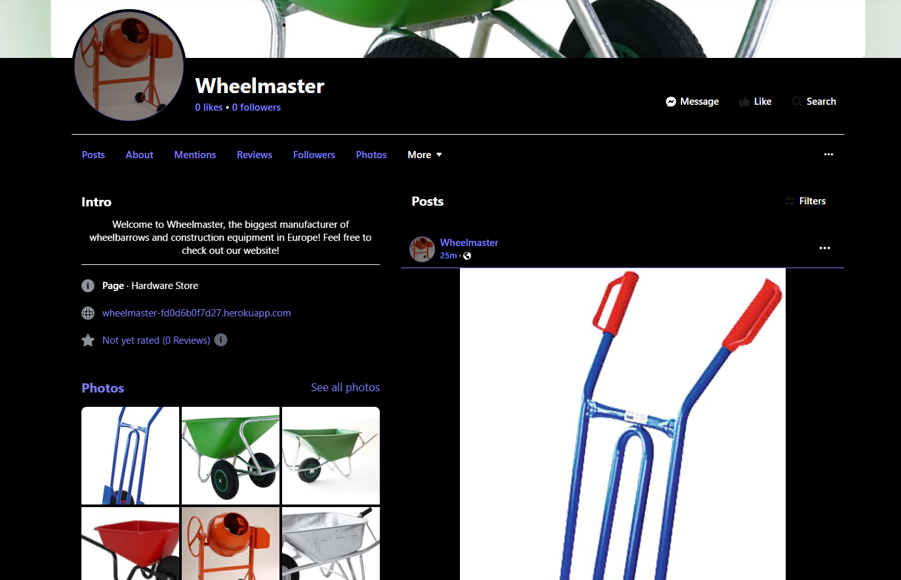

# Table of Content

1. [Business Model](#business-model)  
2. [Revenue Streams](#revenue-streams)  
3. [Planned Marketing Strategies](#planned-marketing-strategies)  
   - [Search Engine Optimization](#search-engine-optimization)  
   - [Social Media Marketing](#social-media-marketing)  
   - [Email Marketing, Newsletter](#email-marketing-newsletter)  
   - [Content Marketing](#content-marketing)  
4. [Google and Social Media Ads](#google-and-social-media-ads)

## Business Model

Wheelmaster follows a **B2B and B2C e-commerce model**, catering to both businesses and individual customers.  

1. **B2B (Business-to-Business)**  
   - Targets construction companies, hardware stores, and bulk buyers.  
   - Offers wholesale pricing, bulk order discounts, and customized solutions for large clients.  
  
2. **B2C (Business-to-Consumer)**  
   - Serves individual customers looking for high-quality wheelbarrows and construction tools.  
   - Ensures a smooth shopping experience with secure payments, fast checkout, and user-friendly navigation.  
   - Includes product ratings and recommendations to enhance the shopping experience.  

## Revenue Streams  

Wheelmaster generates revenue through:  

- **Direct sales**: Selling products to customers via the online store.  
- **Bulk orders & wholesale deals**: Special pricing for business customers.  
- **Seasonal discounts & promotions**: Boosting sales during peak periods with time-limited deals.  

## Planned Marketing Strategies  

To reach and attract both business and individual customers, Wheelmaster employs the following digital marketing strategies:  

### Search Engine Optimization

To improve the search index rating on Google, I used [QuestionDB](https://questiondb.io/report/cd895bd8-a411-420b-a9a7-73273d5a8b69) to search for relevant keywords to use in meta tags, alt-texts and content elements of the project.

A number of short and long-tail keywords were selected from the searches for "wheelbarrow" and "concrete mixer":

- wheelbarrow tire
- wheelbarrow home depot
- wheelbarrow steel
- wheelbarrow amazon
- how much does a wheelbarrow cost
- why are wheelbarrows so expensive
- what makes a good wheelbarrow
- is it cheaper to mix your own concrete
- concrete mixer rental

These keywords are only examples, the search needs to be expanded and more detailed for all the products and should then be integrated into Meta Descriptions and Headings in the near future.

### Social Media Marketing

- A fake business page was created on Facebook (for B2C), a real shop should have presence on Instagram and LinkedIn (for B2B). The link to the fake Facebook page is [wheelmaster on Facebook](https://www.facebook.com/profile.php?id=61573992207277)

Screenshot of the Facebook page:

Social network links should include the rel="noopener nofollow" attribute, which prevents search engines from following them and affecting our SEO ranking.

### Targeted ads

- Targeted ads to reach customers in the construction and home improvement sectors.  
- Sharing user-generated content, product demonstrations, and customer testimonials.  

### Email Marketing, Newsletter

- Sending personalized emails with product recommendations and exclusive discounts.  
- Keeping B2B customers engaged with bulk order promotions and loyalty discounts.  

### Content Marketing

- Publishing blog posts and guides on construction tools and industry tips.  
- Creating video content showcasing product durability and usage.  

### Google and Social Media Ads

- Running paid campaigns to drive traffic to the store.  
- Using retargeting ads to bring back visitors who have abandoned their carts.  

### Sitemap.xml

- Included a sitemap.xml to allow search engine bot crawling.

### Robots.txt

- Included a robots.txt file to control search engine bot crawling.

By combining these strategies, Wheelmaster aims to increase brand awareness, boost online sales, and build a strong customer base in both B2B and B2C markets.
